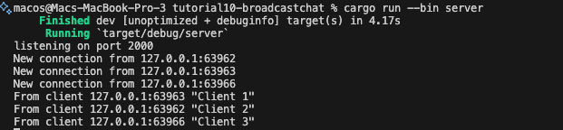
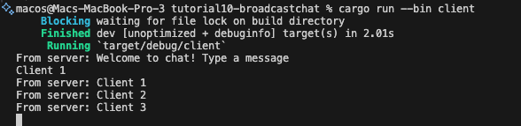
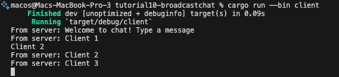
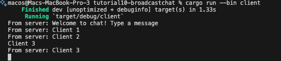
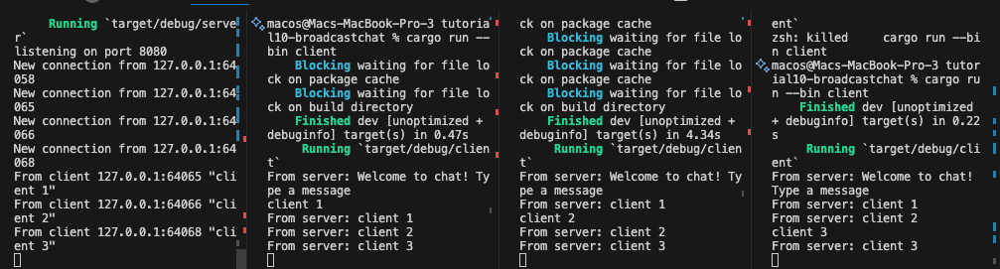
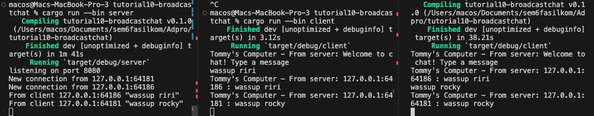

# Tutorial 10 - Advanced Programming - Brodcast Chat Application

## Original Code

Untuk menjalan server saya menggunakan perintah `cargo run --bin server`. Untuk menjalankan client saya menggunakan perintah `cargo run --bin client`. Ketika pengguna berinteraksi dengan WebSocket, baik sebagai klien atau server, pesan yang dikirim oleh salah satu klien akan diteruskan oleh server ke semua klien yang terhubung. Ini menciptakan efek "broadcast" di mana pesan yang dikirim oleh satu klien akan diterima oleh semua klien yang terhubung.

## Modifying the websocket port

Untuk memastikan koneksi yang lancar, penting untuk memastikan bahwa kedua sisi, baik client maupun server, menggunakan port yang sama. Jika port yang digunakan oleh client dan server berbeda, koneksi tidak akan berhasil karena client akan mencoba terhubung ke server menggunakan port yang berbeda dari yang diharapkan.

## Small changes. Add some information to client

Untuk mencapai tujuan tersebut, Anda dapat memperbarui logika pada `bcast.tx` di server sehingga setiap pesan yang dikirim ke client juga mencakup alamat IP pengirim. Dengan cara ini, setiap client menerima pesan dari server yang tidak hanya berisi isi pesan, tetapi juga informasi tentang alamat IP pengirim. Hal ini memungkinkan client untuk mengetahui asal pesan yang diterima.
